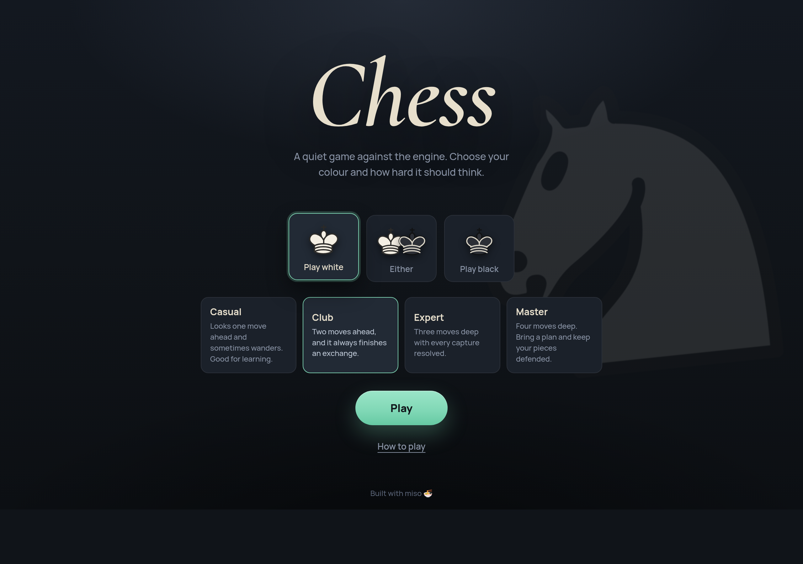
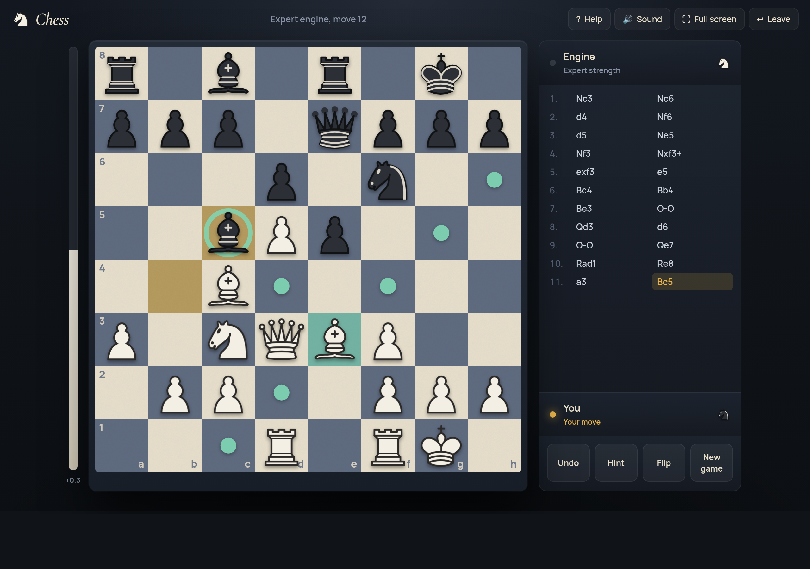

# ♞ chess

**Chess against a built-in engine** — four strengths, every rule of the
game, and a board that glides — built with
[miso](https://github.com/dmjio/miso) and compiled to WebAssembly.

**Play it live: <https://chess.haskell-miso.org>**





- ♟ The whole game: castling both ways, en passant, promotion to any
  piece, check and checkmate, and every draw — stalemate, threefold
  repetition, the fifty-move rule, insufficient material
- 🧠 A real engine: negamax alpha-beta with a capture-only quiescence
  search, MVV-LVA move ordering, and a material + piece-square
  evaluation with an endgame king table. Four strengths from one ply to
  four; the casual level picks among its near-best moves so it stays
  beatable
- 📊 An evaluation bar beside the board, a hint that marks the move the
  engine would play for you, and undo that takes back a full move — even
  after the game ends, so you can replay the ending
- 📜 The game record in standard algebraic notation with proper
  disambiguation (`Nbd2`, `R1a3`, `Qa1b2`), check and mate suffixes, and
  a Copy PGN button at the end
- 🖐 Tap or drag to move: legal targets are shown as dots and capture
  rings, the last move stays lit, a pinned piece tells you it can't move,
  and pawns get a promotion tray
- 🔄 Play either colour (or let the engine choose); flipping the board
  spins it in place while the pieces stay upright
- ⌨️ Keys: U undo, F flip, H help, M sound, N title, esc cancel
- 📱 Mobile-first: the board fills the phone, the ledger tucks beneath it,
  and the eval bar turns horizontal
- 🔊 Sound synthesized live with the Web Audio API — wooden knocks for
  moves, a heavier one for captures, a small bell for check (zero audio
  assets)
- 🌙 A chess study at night: one pool of light, a board of bone and slate
  stone on a dark plinth, Cormorant Garamond and Manrope, and only two
  accents — mint for what you can do, amber for what just happened —
  built on `Miso.Lens`, `Miso.CSS`, and `Miso.CSS.Color`

## The engine

The rules and the search are pure modules that know nothing about the
DOM:

- `Chess` is the rulebook: move generation, legality with a pin-aware
  fast path, `applyMove`, status with every draw rule, FEN in both
  directions, SAN, and `perft`
- `Engine` is the search: negamax alpha-beta, quiescence, move
  ordering, evaluation, and the four levels. Randomness comes in as a
  supply of uniform doubles so every decision is reproducible
- Every piece carries a stable id, which is what lets the view animate a
  piece sliding from square to square

## Build (WASM)

```bash
nix develop .#wasm --command make
make serve   # serves public/ on :8080
```

## Tests

The rules and the engine are tested natively:

```bash
cabal test
```

Checks include: perft node counts on the standard positions (the start
position to depth 4, Kiwipete, and the pin/en-passant/promotion
positions), castling and pin legality, every draw rule, SAN
disambiguation and suffixes, FEN round trips, and engine sanity — it
finds mates in one, takes free material, avoids a back-rank mate, and
moves within a time budget.

CI builds with nix and deploys `public/` to GitHub Pages on pushes to
`master`.
